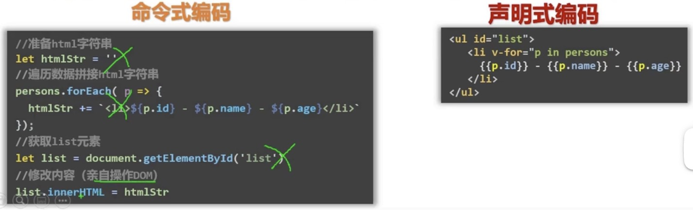
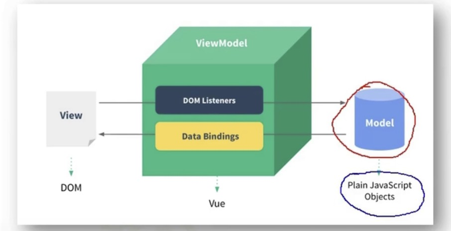

# myVue
Vue的特点
1. 组件化模式 HTML+CSS+JS 封装成 vue
2. 声明式编码(以前是命令式编码)

3. 使用虚拟DOM: 数据=>虚拟DOM(Diff算法)=>页面真实DOM

## 预备知识
ES6语法规范，ES6模块化，原型，原型链，axios, promis

## docs
- API
- cookbook
- 资源列表
  - awesome vue: 

## 使用

### 使用1
1. 直接用<script src>引入Vue.js(开发版本)/生产版本.
2. 创建Vue实例同时传入配置.
  - el:容器
  - data:

## MMVM

1. M model: 对应data中的数据 (JS objects)
2. V view: 模版 (DOM)
3. VM： 视图模型(ViewModel): Vue实例对象.

2条路径: DOM listeners, Data Bindings

### 数据代理：

## 知识点

### Vue的属性配置及知识点
- el
- data
  - 插值语法
  - 数据绑定v-bind
  - 双向绑定v-model
- methods
  - 事件处理
- computed
  - 计算属性
- watch
  - 深度监视

### 